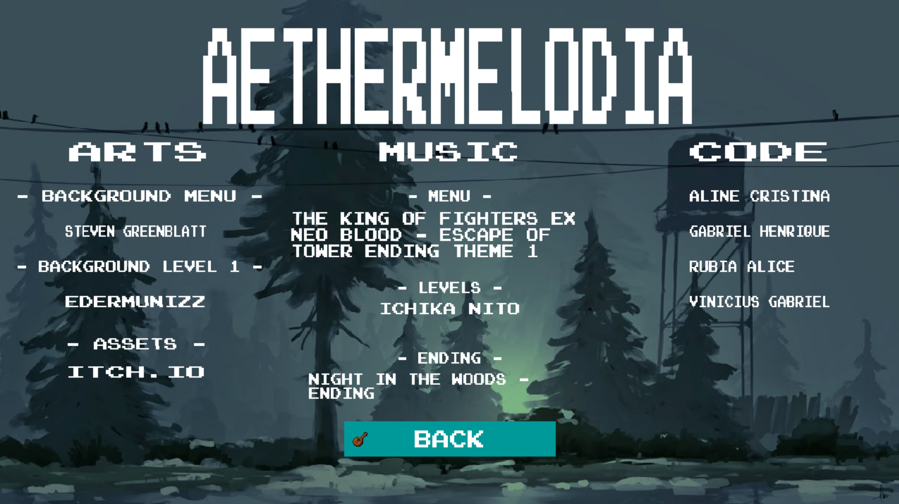
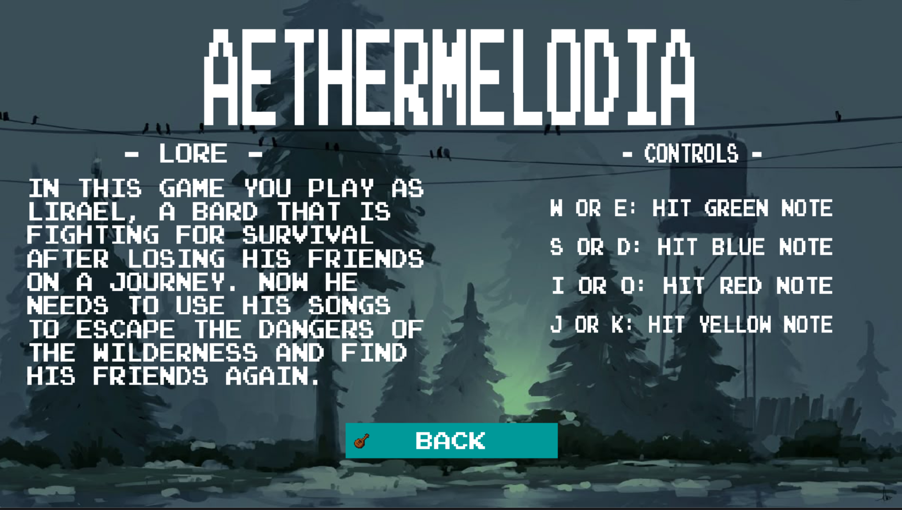
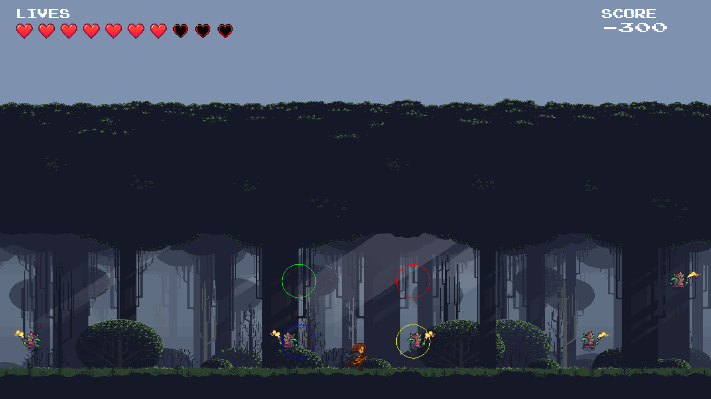

# Aethermelodia

## Screenshots

## Título
Aethermelodia

## Descrição
Aethermelodia é um jogo de ação rítmica onde música e combate se entrelaçam. Nós estamos explorando as ideias de ritmo e imersão musical vinculada ao combate do jogo, em que o jogador precisa apertar os botões no momento ideal do ritmo da música de fundo para que o personagem ataque o inimigo.

Em Aethermelodia, o jogador assume o papel de Lirael, um bardo que precisa aprender a lutar para sobreviver após se perder de seus companheiros em uma terra vibrante, mas repleta de perigos. Sem experiência em combate, ele descobre que suas habilidades musicais são mais do que arte - são sua única forma de defesa. Sua jornada se baseia em canalizar o poder do ritmo e da harmonia para enfrentar os desafios do caminho.

O jogo é composto por fases, onde ritmos complexos e inimigos fortes surgem conforme Lirael avança. Dentro de cada fase, inimigos aparecem em padrões sincronizados com a batida da música. O jogador deve pressionar teclas específicas no tempo correto para realizar ataques. Lirael está cercado de quatro filas de inimigos, e precisa acertá-los no momento correto para derrotá-los, às vezes mais de um ao mesmo tempo! Além disso, alguns inimigos são mais longos e mais fortes, exigindo que Lirael continue seu ataque enquanto o inimigo sobreviver (aperte e segure a tecla de ataque respectiva ao inimigo).

Cada inimigo que sobrevive o suficiente para chegar perto de Lirael ataca o nosso herói, que perde uma vida. Mas ele não há de tombar, uma estranha bênção concedida por essa terra musical faz com que Lirael se cure ao acertar seu inimigo. Sendo assim, cada acerto concede a Lirael a recuperação de uma vida (até a sua vida máxima, que é 10).

O objetivo é nada mais nada menos do que a sobrevivência. Para vencer, nosso protagonista deve sobreviver a horda de inimigos até o fim da música. Caso sua vida chegue a 0, ele sucumbirá.

## Funcionalidades a serem testadas
Essas são as principais funcionalidades apresentadas:
* Uso intuitivo do menu com as teclas W, A e Enter.
* Conteúdo da tela com instruções básicas.
* Sincronia da música da fase com o spawn e movimentação dos inimigos.
* Sincronia da música com os inimigos compostos (notas longas).
* Inimigos devem se manter levemente dentro dos alvos para uma janela maior de acerto para o jogador.
* Dificuldade: A demo está setada por padrão no modo Easy, sendo assim os inimigos devem aparecer apenas nos alvos verde, azul e vermelho.
* Ao apertar as teclas, seus respectivos alvos devem piscar e uma tentativa de hit ocorrerá no alvo.
    * A -> alvo verde (superior esquerdo).
    * S -> alvo azul (inferior esquerdo).
    * D -> alvo vermelho (superior direito).
    * F -> alvo amarelo (inferior direito).
* Acerto de um inimigo simples (key_in e key_out devem ser imediatos, o inimigo deve morrer com a animação de morte, a pontuação deve ser incrementada, se o jogador não estiver com vida máxima, uma vida deve ser recarregada).
* Acerto de um inimigo composto (key_in, a tecla deve ser segurada, key_out, enquanto o comprimento do inimigo durar, sua barra deve ficar da cor do alvo, ao segurar a tecla até o fim da barra, os efeitos de acerto de inimigo devem acontecer).
* Erro de um inimigo simples (se a janela de acerto do inimigo acabar e ele nao morrer, uma vida deve ser perdida, a pontuação deve ser decrementada).
* Erro de um inimigo composto (se a tecla não for segurada por todo o comprimento do inimigo, uma vida deve ser perdida, a pontuação deve ser decrementada).
* Erro de timing (ao acertar um alvo que não possui nenhum inimigo uma vida deve ser perdida, a pontuação deve ser decrementada).
* HUD pontuação deve ser atualizada de acordo com os eventos do jogo.
* HUD das vidas deve ser atualizada de acordo com os eventos do jogo.
* Caso o jogador chegue a 0 vidas, ele deve perder o jogo e uma animação de morte deve ser exibida, bem como uma tela de game over.

## Créditos
* Aline Cristina Pinto
    * Leitura do arquivo de charts e sincronização com a música.
    * Tudo que envolve o Lirael.
    * Cenas iniciais e de game over.
* Gabriel Henrique dos Santos Gonçalves
    * Sistema de vidas.
    * HUD.
    * Cena de to be continued.
* Rubia Alice Moreira de Souza
    * Cena inicial, de instruções e créditos.
    * Sincronização com a música.
    * HUD.
* Vinicius Gabriel Silva Ferreira
    * Gameplay e lógica dos inimigos simples.
    * Gameplay e lógica dos inimigos contínuos.
    * Leitura do arquivo de charts e sincronização com a música.
